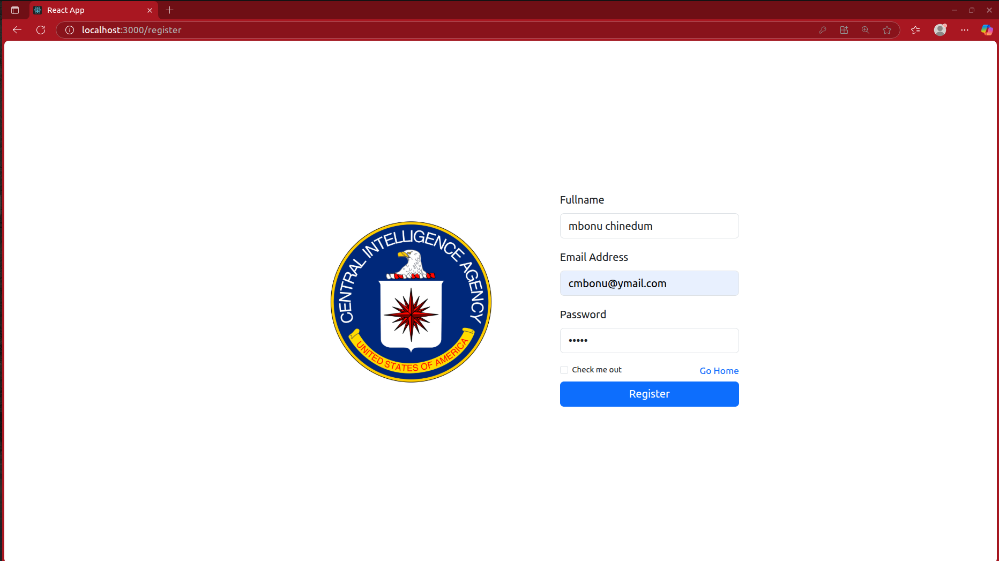
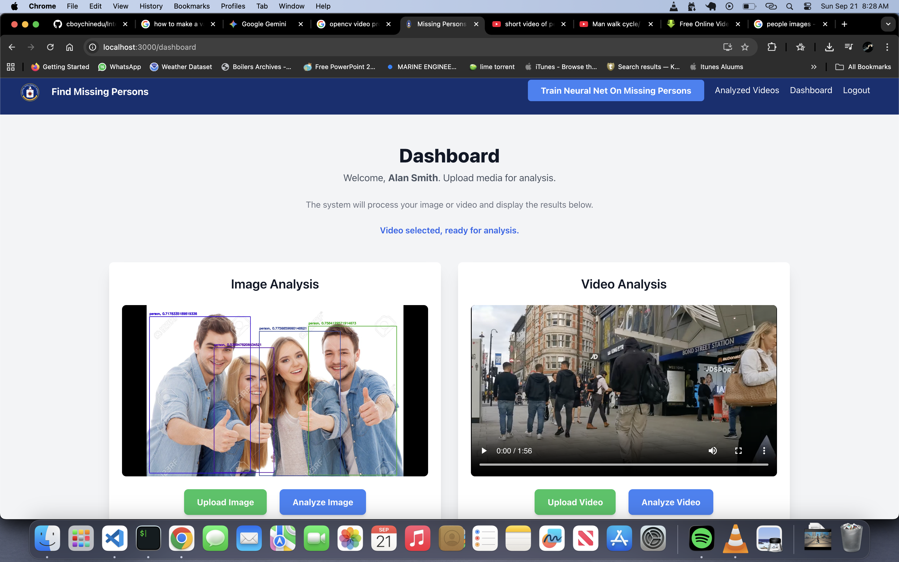
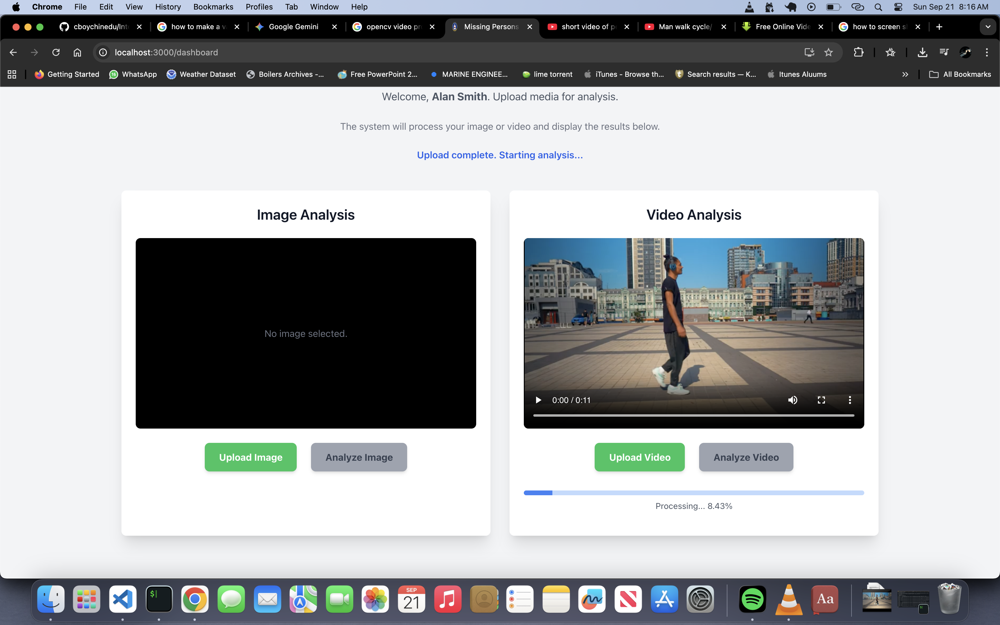
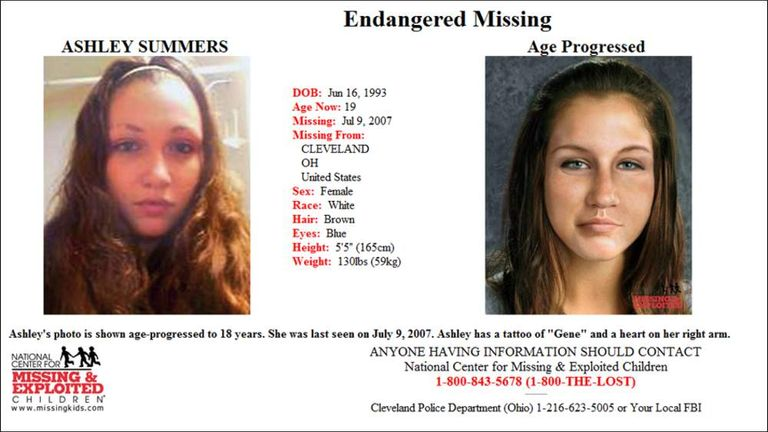

# Finding Missing Persons








<h3> Find Missing Persons: A Machine Learning Analysis Application </h3>

<h4> Project Overview </h4> 

<p>

The Find Missing Persons application is a powerful, full-stack web tool designed to assist in locating missing individuals through advanced media analysis. The platform provides a secure dashboard where authorized users can upload images and videos for real-time analysis, detecting persons of interest and providing immediate feedback. <br>

This project demonstrates a complete development cycle, from building a responsive user interface with React and Tailwind CSS to creating a robust backend with Node.js, Express, and Socket.IO for real-time communication. <br>

This project is a web application designed to help find and report lost persons. It provides a platform for users to register, report missing individuals, and access information about ongoing cases.

</p>


<h3> Inspiration </h3>

<p> 
The genesis of the findLostPerson project lies in the ongoing case of <b> Ashley Nicole Summers</b>. 

Ashley, born June 16, 1993, was 14 years old when she disappeared near her home in Cleveland, Ohio, in early July 2007.

<b> Key details from her case that informed this project:</b>

- She was last seen on July 4, 2007.

- Because she was frequently staying with her relatives, her disappearance tragically went unnoticed for two days.

- Earlier that day, her ability to contact family or friends was removed when her phone was broken.

Her case where every hour was critical—is a powerful motivation to develop better, faster technologies for locating lost or missing individuals.

I believe if we are able to train a machine learning model, and perform an analysis on all camera frames, we should be able to locate her or know her last know location. 

</p>

## Technologies Used
- React
- Python 
- Nodejs 
- Typescript 
- CSS Modules (Tailwind CSS)
- Tensorflow 
- JavaScript

<h3> Key Features </h3>
<p> 
<ul>
<li> <b> User Authentication: </b> Secure login and registration system. </li> 
<li> <b> Media Upload & Analysis: </b> Upload images and videos to be processed by a backend analysis engine trained on the missing persons images and data </li> 
<li> <b> Real-time Progress Tracking: </b> Live updates on the analysis progress via a WebSocket connection. </li> 
<li> <b> Live Detection Events: </b> Receive instant notification when a person is detected in a video stream. </li> 
<li> <b> Responsive Design: </b> A modern, mobile-first user interface that adapts to all screen sizes. </li> 
<li> <b> Persistent Storage: </b> Manager user data and analysis results. </li> 
</ul>
</p>


<h3> Technologies Used </h3> 
<h4> Frontend </h4> 
<p> 
<ul>
<li> React: A javascript library for building user interfaces </li> 
<li> Tailwind CSS: A utility first CSS framework for rapid UI development. </li> 
<li> Socket.IO Client: Enables real-time, bidirectional communication between the clinet and server. </li> 
<li> Axios: A promise-based HTTP client for making API requests. </li> 
</ul>
</p>

<h4> Backend </h4>

<p> On Mac, start the mongodb server </p>

```bash 
    $ brew services start mongodb/brew/mongodb-community
```

<p>
<ul>
<li> Node.js & Express: A robust and scalable backend runtime and web framework. </li>

<li>TypeScript: A typed superset of JavaScript that compiles to plain JavaScript.</li>

<li>Socket.IO: A library for building real-time applications. </li>

<li>JWT (JSON Web Tokens): For secure user authentication and authorization.</li>

<li>ts-node-dev: For live reloading during development, automatically recompiling TypeScript files on changes.</li>

<li>Bcrypt: For hashing user passwords securely.</li>
</ul>
</p>

<h3> Getting Started </h3> 

<p> Follow these steps to set up the project locally </p>

<h4> Prerequisites </h4> 
<p> You must have <b> Nodejs, Npm, Python3, Mongodb database </b> installed on your machine </p> 

<h4> 1. Backend Setup </h4> 
<p> First, set up the Nodejs backend to handle API requests and real time communication </p>

<h3> Installation </h3> 

1. Clone the repository for ssh:
   ```bash
   git clone git@github.com:cboychinedu/findLostPersons.git
   
   cd findLostPersons/

   cd backend/ 
   ```
2. Install dependencies: 
   ```bash
   npm install . 
   ```
3. Start the development server:
   ```bash
   npm start
   ```

<h4> 2. Python Backend Setup </h4> 
<p> 
Open another terminal and navigate to where the findLostPersons folder is located. <br> 

Once you find it, navigate into the folder and change your directory into the <b> mlServer </b>
</p>

1. Change directory into the mlServer 

```bash 
  $ cd mlServer/ 
```

2. Install the required dependencies 
```bash
  $ pip install -r requirements.txt 
```

3. Start the machine learning server 
```bash 
$ python app.py 
```

<h3> 3. React Server Setup </h3>
<p> 
Open another terminal and navigate to where the findLostPersons folder is located. <br> 

Once you find it, navigate into the folder and change your directory into the <b> myapp/ </b> folder. 
</p> 

1. Change directory into the myapp/ folder. 

```bash 
  $ cd myapp/ 
```

2. Install dependencies 

```bash 
  $ npm install . 

```

3. Start the reactjs application server 

<p> Start the React development server. </p> 

```bash 
  $ npm start 
```

<p> This will open the application in your default web browser at 

```bash 
http://localhost:3000 
```

<h3> How to Use the Application </h3> 

<p>
<ol> 
<li> Registration & Login: </li>
<ul>
<li> Navigate to the registration page to create a new user accout. </lI> 
<li> Log in using your credential to access the secure dashboard. </li> 
</ul>

<li> Dashboard: </li> 
<ul>
<li> On the dashboard, you will find two main section: Image Analysis and Video Analysis. </lI> 
<li> Image Analysis: </li>
<ul>
<li> Click "Upload Image" to select an image file from your computer. </li> 
<li> The image will appear in the preview window. </li> 
<li> Click "Analyze Image" to send the file to the backend for processing. </li> 
</ul>

<li> Video Analysis: </li>
<ul>
<li> Click <b> Upload Video </b> to select a video file. </li> 
<li> The video will appear in the preview window. </li> 
<li> Click <b> Analyze Video </b> to upload the file and begin the analysis </li> 
</ul>
</ul>
</ol>
</p>


<h3> Credits </h3> 
<p> 
This project was developed using a variety of open-source libaries and frameworks. A huge thank you to the creators and maintainers of:
</p>

- React
- Node.js & Express
- Tailwind CSS
- Socket.IO
- TypeScript
- ts-node-dev
- jsonwebtoken
- bcrypt


<p> References </p>

- https://markaicode.com/solving-cors-errors-react-nodejs-guide/ 


<h3> Creator </h3> 
<p> This program was created by <b> Engr Mbonu Chinedum </b> </p>


